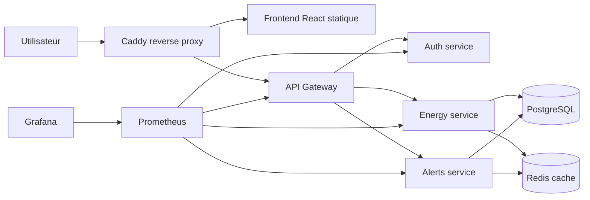

# Architecture GreenOps Platform

## Reseaux Docker

- `edge` : exposition publique via Caddy.
- `backend` : communication entre reverse proxy, gateway et services applicatifs.
- `data` : acces limite aux services PostgreSQL et Redis.
- `monitoring` : Prometheus et Grafana.

## Justification des choix

Les services applicatifs sont compiles en Go et executes dans des images `scratch` pour limiter la taille et la surface d'attaque. Caddy centralise les entrees HTTP et l'API Gateway isole les services internes. PostgreSQL persiste les metriques et alertes, Redis sert de cache court terme, Prometheus collecte les metriques applicatives et Grafana les visualise.
